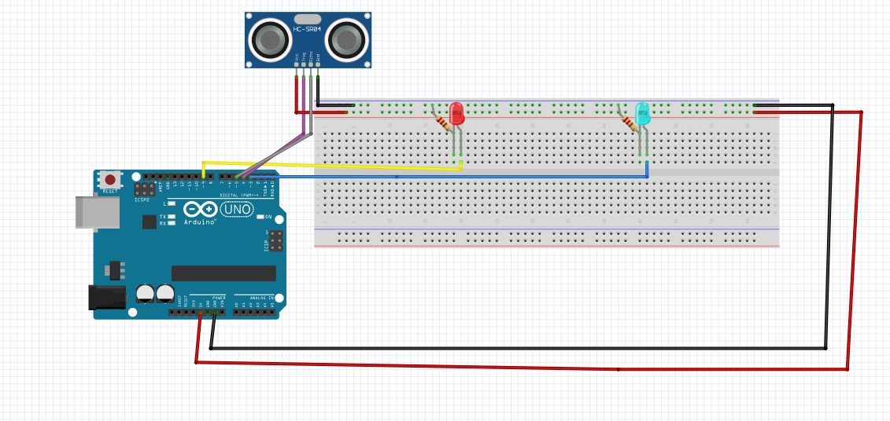
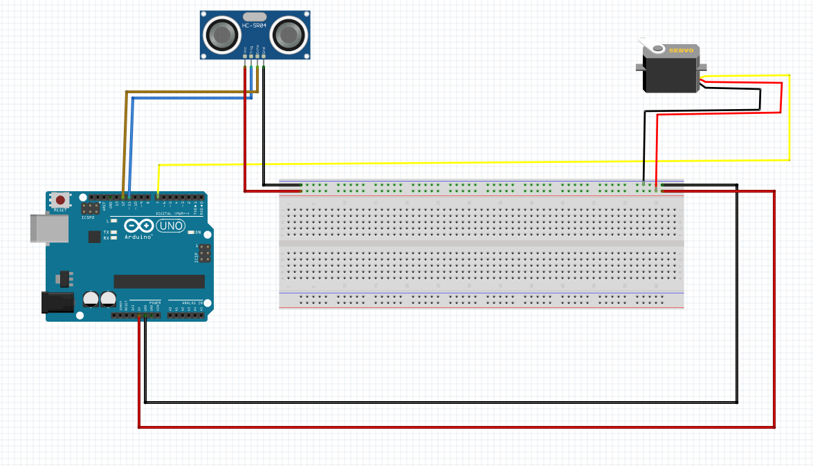

## New ping
Newping is when i made 2 leds blink depending on the distance given by the sensor. the assignment was to use a sensor to make something happenand i chose to have a red led blinkwhen cm < 10 and a blue led blink when cm>10
### Wiring Diagram

### What i learned
i learned how to use the NewPing library and the commands in the library to make the code a lot shorter than it would be using functions because the functions are int he library.

## HELLO FUNCTIONS
hello functions is when a servo spun in different directions depending on the distance returned by the sensor.

## Wiring Diagram

### What I Learned
I learned how to use functions to separate the different parts of the code that do different things so i can see what each part is about and i also learned how to use a HCSR04 sensor.

